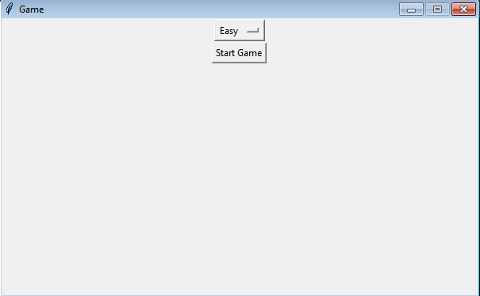
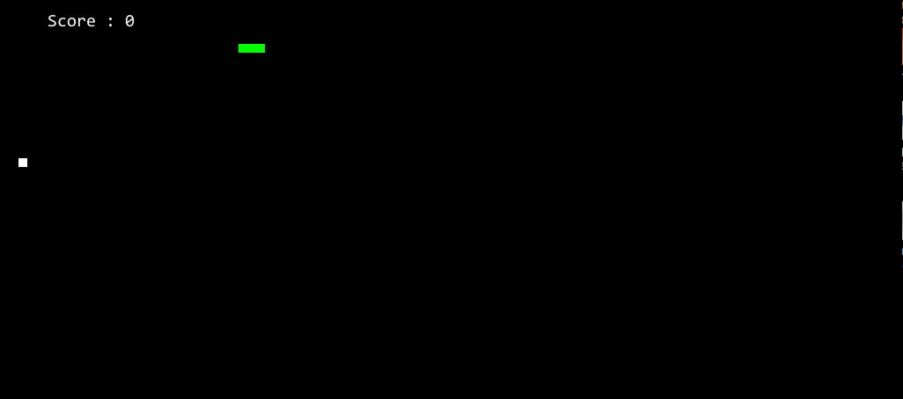

# SnakeGame

Simple 2d game using paygame with python

___Install PyGame Library First___
    
    pip install pygame
   
    
## Run

In order to run this program, it is crucial that you are on a __Linux-based__ distro, preferably __Windows__.

First, `git clone`.

    https://github.com/nasimmahamadshamem/SnakeGame.git

Change directory, and then run the python script (__Linux OS__):

    cd path/SnakeGame
    python Lobby.py
    
    
__OR__

portable file you can run on __Windows__:
    
    Dubble click on SnakeGame/build/lobby.exe

__Linux os__
    
    cd SnakeGame/build/
    sudo ./lobby

### Screenshort

Simple Game Lobby

Game Play Screen

